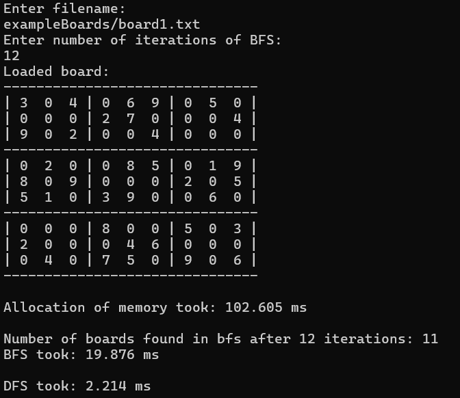
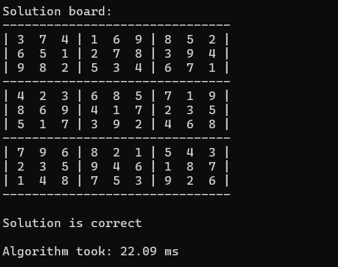

# Sudoku Solver

This is a **GPU-accelerated Sudoku Solver** implemented in **C++** with **CUDA**. The project demonstrates how parallel computing can significantly speed up solving complex Sudoku puzzles by distributing computations across thousands of GPU threads.

---

##  How It Works
The solver uses a combination of **breadth-first search (BFS)** and **depth-first search (DFS)**:
- **BFS** is used to generate thousands of partially solved boards in parallel.
- **DFS** is then launched in parallel to search for the correct solution among the generated boards.

Both BFS and DFS are implemented inside a CUDA kernel to fully utilize the GPU's parallel computing power.

---

## Tech Stack
- **Language**: C++
- **GPU Framework**: CUDA

---

## Presentation

